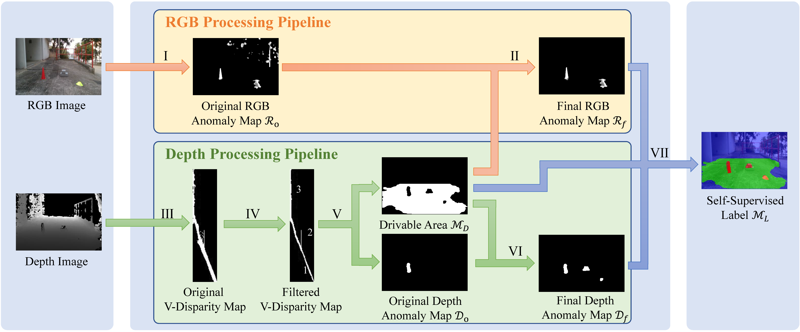

# Self-Supervised Label Generator

This is a MATLAB demo of the self-supervised label generator (SSLG), presented in our RA-L paper, [Self-Supervised Drivable Area and Road Anomaly Segmentation using RGB-D Data for Robotic Wheelchairs](https://arxiv.org/abs/2007.05950). Our SSLG can be used effectively for self-supervised drivable area and road anomaly segmentation based on RGB-D data. The code has been tested in MATLAB R2020b.

<p align="center">

</p>

We provide five examples in `examples`, where `rgb`, `depth_u8`, `depth_u16` and `label` contains RGB images, normalized depth images, original depth images and segmentation labels, respectively. Run `demo.m`, and then you will see the generated labels, which will also be saved in `examples/output`.

These examples belong to our GMRP dataset, an RGB-D dataset of drivable area and road anomaly segmentation for ground mobile robots (e.g., sweeping robots and robotic wheelchairs). Please refer to [here](https://github.com/hlwang1124/GMRPD) for more information.

If you use this code for your research, please cite our paper.
```
@article{wang2019self, 
  author={Wang, Hengli and Sun, Yuxiang and Liu, Ming},
  journal={IEEE Robotics and Automation Letters}, 
  title={Self-Supervised Drivable Area and Road Anomaly Segmentation Using RGB-D Data For Robotic Wheelchairs}, 
  year={2019}, 
  volume={4}, 
  number={4}, 
  pages={4386-4393}, 
  doi={10.1109/LRA.2019.2932874}, 
  ISSN={2377-3766}, 
  month={Oct}
}
```
